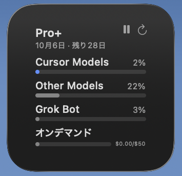
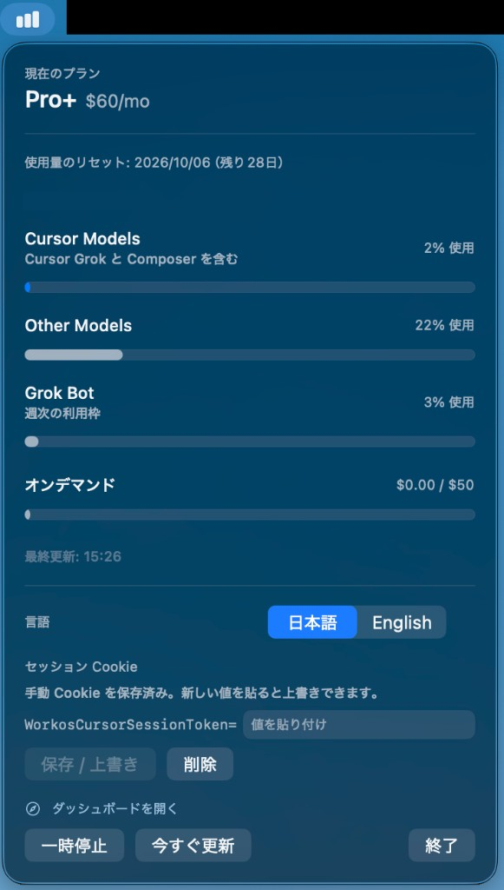

# Cursor使用量ウィジェット

[English](README.en.md)

Cursor などの AI サービスのプランと使用量を、macOS のメニューバーと
WidgetKit ウィジェットでいつでも確認できるアプリです。

[東京地下鉄ウィジェット](https://github.com/shigeya-t/subway-widget) と同じく、
**メニューバー常駐アプリが取得し、ウィジェットは表示だけ** という構成です。

<p align="center">
  
  &nbsp;
  
</p>

## 作った動機

Cursor のダッシュボードには Plan & Usage がありますが、残りクレジットが減っても
目立つ通知は出ないようです。気づいたときには枠を使い切っていて、オンデマンド課金に
かなりはみ出していた、ということがありました。

設定ページを毎回開かなくても、メニューバーやデスクトップのウィジェットを一目見れば
プラン枠とオンデマンド残高が分かるようにしたくて作りました。

## できること

- Plan & Usage 相当の表示（プラン名・リセット日・Cursor Models / Other Models・On-Demand）
- メニューバー常駐（Dock には出ません）とウィジェット（小・中・大）
- 日本語 / English の切り替え（アプリとウィジェットで共有）
- 一時停止と今すぐ更新（アプリ・ウィジェットの両方）
- セッション Cookie の保存・上書き・削除
- 他の AI サービス向けに差し替えやすい汎用スナップショット（v1 は Cursor のみ）

## 必要なもの

- macOS 14 以降
- Xcode 15 以降
- [XcodeGen](https://github.com/yonaskolb/XcodeGen)（`brew install xcodegen`）
- Cursor.app へのログイン、またはブラウザの `WorkosCursorSessionToken` Cookie

## ビルドと導入

```sh
brew install xcodegen
cp Config/Team.xcconfig.example Config/Team.xcconfig
./scripts/sync-team.sh
xcodegen generate
./scripts/test.sh
swift scripts/generate-app-icon.swift
./scripts/deploy-local.sh                 # ~/Applications と build/ へ配置
```

`deploy-local.sh` は Team 付きで署名してから配置します。アドホック署名では
AppIntents が解決できず、ウィジェットがプレースホルダのまま止まります。
証明書が複数あるときは `DEVELOPMENT_TEAM=XXXXXXXXXX ./scripts/deploy-local.sh` です。

配置後、「ウィジェットを編集」から **Cursor使用量** を追加してください
（英語のシステム言語では **Cursor Usage**）。
常時使う場合は、システム設定 →「一般」→「ログイン項目」に登録しておくと便利です。

## 認証（Cursor）

個人の Plan & Usage は公式 Admin API では取れません。このアプリはダッシュボードが
使う非公式エンドポイント `GET https://cursor.com/api/usage-summary` を呼び出します。

セッションの解決順:

1. メニューバーに保存した `WorkosCursorSessionToken`（Keychain）
2. Cursor.app の `state.vscdb`（`cursorAuth/accessToken`）

Cookie を手動で入れる場合:

1. https://cursor.com/dashboard?tab=usage を開く
2. DevTools → Application → Cookies → `WorkosCursorSessionToken` の **Value** をコピー
3. メニューバーの入力欄（名前は固定表示）に値だけ貼り付けて保存

セッション Cookie / JWT はログに出しません。ウィジェットへ渡すのは使用量のスナップショットだけです。

## 更新のしくみ

メニューバーに常駐しているあいだだけ、ウィジェットはほぼ最新のまま保たれます。

- 取得はメニューバーアプリに一本化（ウィジェット拡張は通信しません）
- 既定は 5 分ごと。App Group 経由でウィジェットへ渡します
- 「一時停止」で自動取得を止め、「今すぐ更新」は停止中でも取り直します

## 他の AI サービスを足すには

`UsageProvider` を実装し、`UsageProviderRegistry.all` に登録します。
UI は `UsageSnapshot`（プラン・パーセント棒・従量）だけを描画します。

## 構成

```
project.yml                  XcodeGen のプロジェクト定義
Shared/                      モデル・Cursor 取得・L10n・App Intents
App/                         メニューバー常駐アプリ
WidgetExtension/             ウィジェット本体（通信しない）
Tests/                       単体テストと JSON フィクスチャ
docs/screenshots/            README 用スクリーンショット
scripts/                     sync-team / test / deploy-local / アイコン生成
```

`Info.plist` と `*.entitlements` は `project.yml` から生成されるため、リポジトリには含めていません。

バンドル ID は `jp.shigeya.AIUsageWidget` です。フォーク時は次も合わせて書き換えてください。

- `project.yml` の `bundleIdPrefix` / `PRODUCT_BUNDLE_IDENTIFIER`
- `Shared/AppSettings.swift` の `Notification.Name` と `groupSuffix`
- `Shared/CursorSession.swift` の Keychain service 名
- `scripts/_common.sh` の `BUNDLE_ID`

App Group は `$(DEVELOPMENT_TEAM).jp.shigeya.AIUsageWidget` です。

## 注意

- `usage-summary` は非公式で、予告なく変わる可能性があります
- 個人の私的利用を想定しています
- Cursor サポートへこのアプリの不具合を問い合わせないでください

## ライセンス

[MIT License](LICENSE)
